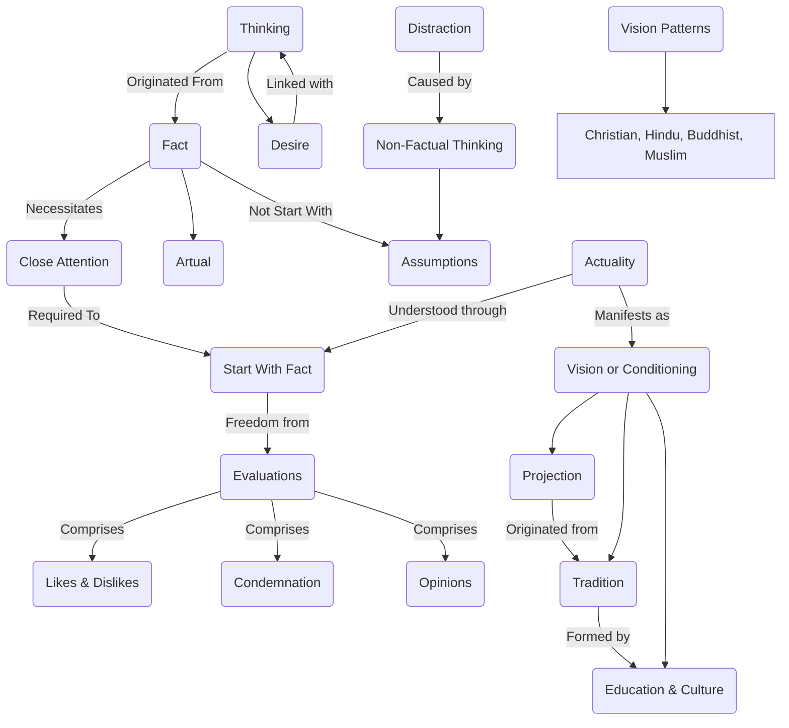

August 8
Understand the actual

It is really not complex, thought it may be arduous. You see, we don’t start with the actual, with the fact, with what we are thinking, doing, desiring; we start with assumptions, or with ideals, which are not actualities, and so we are led astray. To start with facts, and not with assumptions, we need close attention; and every form of thinking not originating from the actual is a distraction. That’s why it is so important to understand what is actually taking place both within and around one....If you are a Christian, your visions follow a certain pattern; if you are a Hindu, a Buddhist, or a Muslim, they follow a different pattern. You see Christ or Krishna, according to your conditioning; your education, the culture in which you have been brought up, determines your visions. Which is the actuality: the vision, or the mind which has been shaped in a certain mold? The vision is the projection of the particular tradition which happens to form the background of the mind. This conditioning, not the vision which it projects, is the actuality, the fact. To understand the fact is simple; but it is made difficult by our likes and dislikes, by our condemnation of the fact, by the opinions or judgments we have about the fact. To be free of these various forms of evaluation is to understand the actual, the what is.

