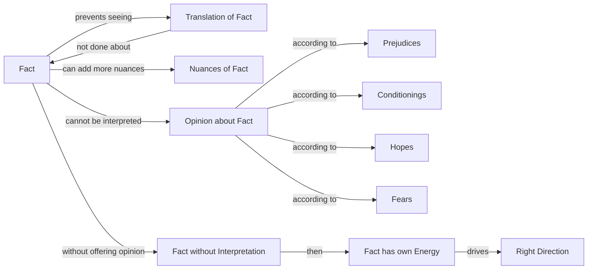

August 9
Translation of the facts prevents seeing

A mind that gives an opinion about a fact is a narrow, limited, destructive mind...You can translate the fact in one way, and I can translate it in another way. The translation of the fact is a curse which prevents us from seeing the actual fact and doing something about the fact. When you and I discuss our opinions about the fact, nothing is done about the fact; you can add perhaps more to the fact, see more nuances, implications, significance about the fact, and I may see less significance in the facts. But the fact cannot be interpreted; I cannot offer an opinion about the fact. It is so, and it is very difficult for a mind to accept the fact. We are always translating, we are always giving different meanings to it, according to our prejudices, conditionings, hopes, fears and all the rest of it. If you and I could see the fact without offering an opinion, interpreting, giving a significance, then the fact becomes much more alive—not more alive—the fact is there alone, nothing else matters; then the fact has its own energy which drives you in the right direction.

