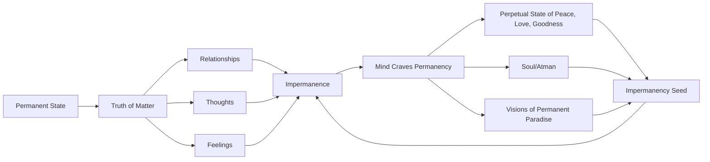

August 10
There is only one fact: impermanence

We are trying to find out if there is, or is not, a permanent state—not what we would like, but the actual fact, the truth of the matter. Everything about us, within as well as without—our relationships, our thoughts, our feelings—is impermanent, in a constant state of flux. Being aware of this, the mind craves permanency, a perpetua l state of peace, of love, of goodness, a security that neither time nor events can destroy; therefore it creates the soul, the Atman, and the visions of a permanent paradise. But this permanency is born of impermanency, and so it has within it the seeds of the impermanent. There is only one fact: impermanence.

