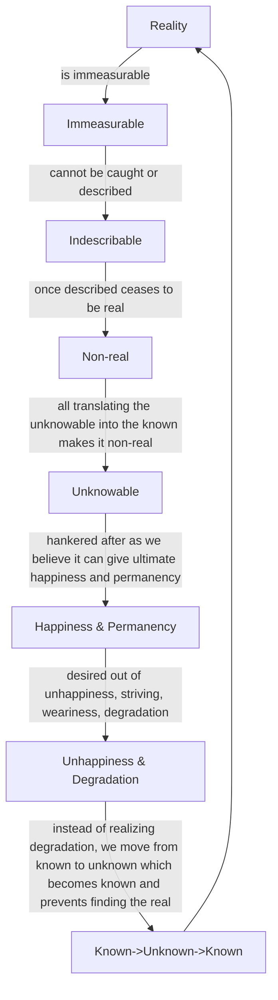

August 11
Hankering after the unknowable

You want me to tell you what reality is. Can the indescribable be put into words? Can you measure something immeasurable? Can you catch the wind in yo ur fist? If you do, is that the wind? If you measure that which is immeasurable, is that the real? If youformulate it, is it the real? Surely not, for the moment you describe something which is indescribable, it ceases to be the real. The moment you translate the unknowable into the known, it ceases to be the unknowable. Yet that is what we are hankering after. All the time we want to know, because then we shall be able to continue, then we shall be able, we think, to capture ultimate happiness, permanency. We want to know because we are not happy, because we are striving miserably, because we are worn out, degraded. Yet instead of realizing the simple fact—that we are degraded, that we are dull, weary, in turmoil—we want to move away from what is the known into the unknown, which again becomes the known and therefore we can never find the real.

