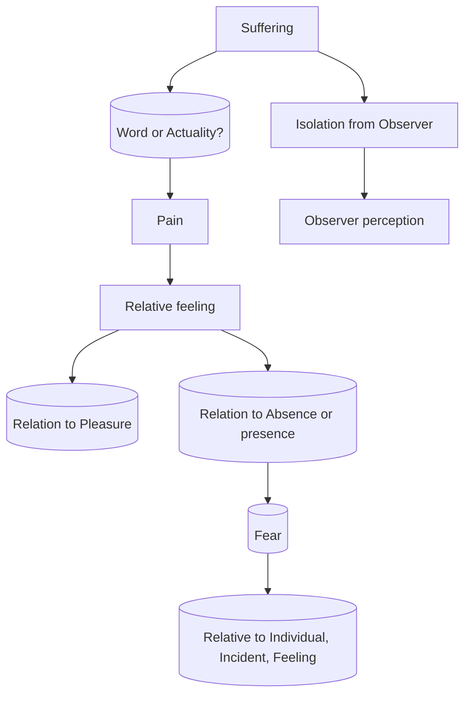

August 12
Is suffering merely a word or an actuality?

Is suffering merely a word, or an actuality? If it is an actuality and not just a word, then the word has no meaning now, so there is merely the feeling of intense pain. With regard to what? With regard to an image, to an experience, to something which you have or have not. If you have it, you call it pleasure; if you haven’t it is pain. Therefore pain, sorrow, is in relationship to something. Is that something merely verbalization, or an actuality?—as fear cannot exist by itself but only in relationship to something: to an individual, to an incident, to a feeling. Now, you are fully aware of the suffering. Is that suffering apart from you and therefore you are merely the observer who perceives the suffering, or is that suffering you?

