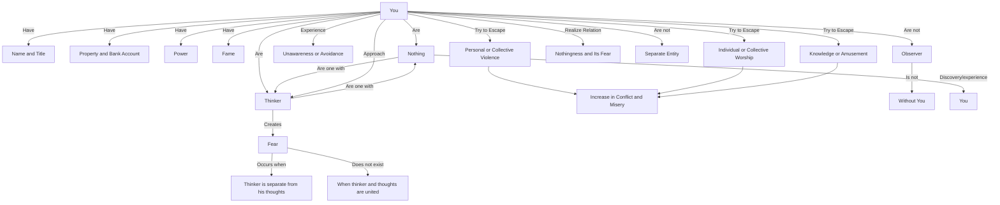

August 13
You and nothingness are one

You are nothing. You may have your name and title, your property and bank account, you may have power and be famous; but in spite of all these safeguards, you are as nothing. You may be totally unaware of this emptiness, this nothingness, or you may simply not want to be aware of it; but it is there, do what you will to avoid it. You may try to escape from it in devious ways, through personal or collective violence, through individual or collective worship, through knowledge or amusement; but whether you are asleep or awake, it is always there. You can come upon your relationship to this nothingness and its fear only by being choicelessly aware of the escapes. You are not related to it as a separate, individual entity; you are not the observer watching it; without you, the thinker, the observer, it is not. You and nothingness are one; you and nothingness are a joint phenomenon, not two separate processes. If you, the thinker, are afraid of it and approach it as something contrary and opposed to you, then any action you may take towards it must inevitably lead to illusion and so to further conflict and misery. When there is the discovery, the experiencing of that nothingness as you, then fear—which exists only when the thinker is separate from his thoughts and so tries to establish a relationship with them—completely drops away.

