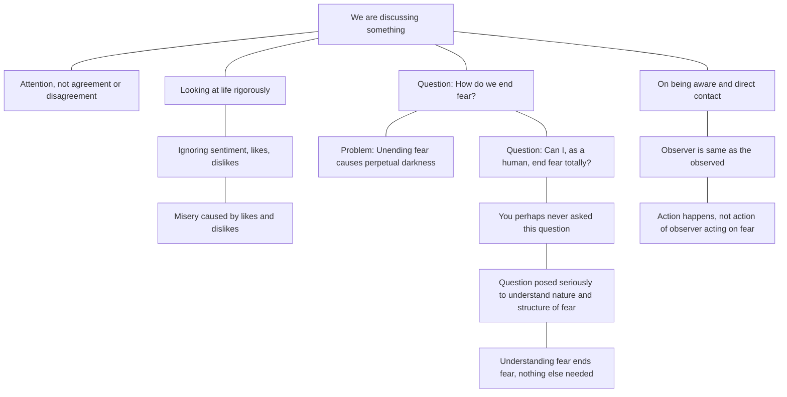

August 14
How do we end fear?

We are discussing something which needs your attention, not your agreement or disagreement. We are looking at life most rigorously, objectively, clearly— not according to your sentiment, your fancy, what you like or don’t like. It’s what we like and don’t like that has created this misery. All that we are saying is this: How do we end fear? That’s one of our great problems, because if a human being can’t end it he lives in darkness everlastingly, not everlastingly in the Christian sense but in the ordinary sense; one life is good enough. For me, as a human being, there must be a way out and not by creating a hope in some future. Can I as a human being end fear, totally; not little bits of it? Probably you’ve never put this question to yourself, and probably you’ve not put the question because you don’t know how to get out of it. But if you did put that question most seriously, with the intention of finding out not how to end it, but with the intention of finding out the nature and the structure of fear, the moment you have found out, fear itself comes to an end; you don’t have to do anything about it.
...When we are aware of it and come into contact with it directly, the observer is the observed. There is no difference between the observer and the thing observed. When fear is observed without the observer, there is action, but not the action of the observer acting upon fear.

