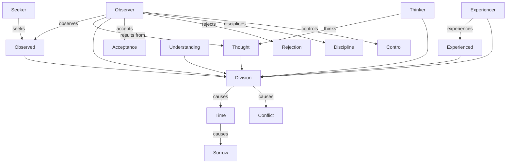

August 15
The duality of thinker and thought

As you watch anything — a tree, your wife, your children, your neighbor, the stars of a night, the light on the water, the bird in the sky, anything — there is always the observer — the censor, the thinker the experiencer, the seeker —and the thing he is observing; the observer and the observed; the thinker and the thought. So, there is always a division. It is this division that is time. That division is the very essence of conflict. And when there is conflict, there is contradiction. There is the observer and the observed — that is a contradiction; there is a separation. And hence where there is contradiction, there is conflict. And when there is conflict, there is always the urgency to get beyond it, to conquer it, to overcome it, to escape from it, to do something about it, and all that activity involves time.. As long as there is this division, time will go on, and time is sorrow.
And a man who will understand the end of sorrow must understand this, must find, must go beyond this duality between the thinker and the thought, the experiencer and the experienced. That is, when there is a division between the observer and the observed, there is time, and therefore there is no ending of sorrow. Then, what is one to do? You understand the question? I see, within myself, the observer is always watching, judging, censoring, accepting, rejecting, disciplining, controlling, shaping. That observer, that thinker, is the result of thought, obviously. Thought is first; not the observer, not the thinker. If there was no thinking at all, there would be no observer, no thinker; then there would only be complete, total attention.

