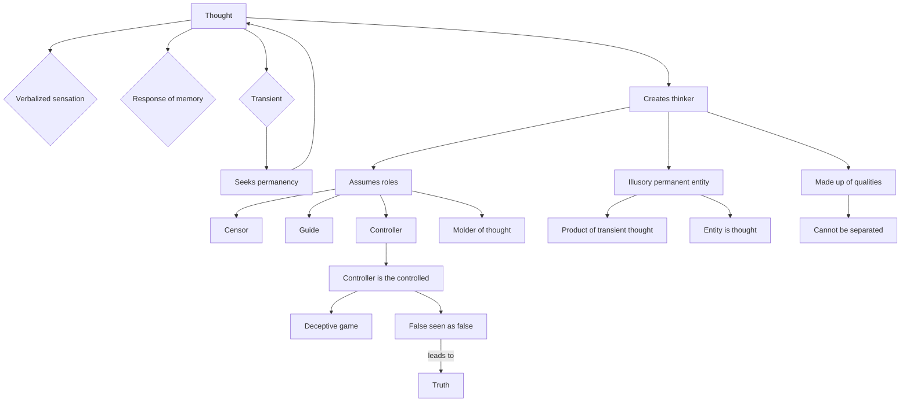

August 16
Thought creates the thinker

Thought is verbalized sensation; thought is the response of memory, the word, the experience, the image. Thought is transient, changing, impermanent, and it is seeking permanency. So thought creates the thinker, who then becomes the permanent; he assumes the role of the censor, the guide, the controller, the molder of thought. This illusory permanent entity is the product of thought, of the transient. This entity is thought; without thought he is not. The thinker is made up of qualities; his qualities cannot be separated from himself. The controller is the controlled, he is merely playing a deceptive game with himself. Till the false is seen as the false, truth is not.

