August 17
A wall of impregnable thought

“How can there be a fusion of the thinker with his thoughts?” Not through the action of will, nor through discipline, nor through any form of effort, control or concentration, nor through any other means. The use of a means implies an agent who is acting, does it not? As long as there is an actor, there will be a division. The fusion takes place only when the mind is utterly still without trying to be still. There is this stillness, not when the thinker comes to an end, but only when thought itself has come to an end. There must be freedom from the response of conditioning, which is thought. Each problem is solved only when idea, conclusion is not; conclusions, idea, thought, are the agitations of the mind. How can there be understanding when the mind is agitated? Earnestness must be tempered with the swift play of spontaneity. You will find, if you have heard all that has been said, that truth will come in moments when you are not expecting it. If I may say so, be open, sensitive, be fully aware of what is from moment to moment. Don’t build around yourself a wall of impregnable thought. The bliss of truth comes when the mind is not occupied with its own activities and struggles.

```mermaid
graph TB
    A["Fusion of Thinker with Thoughts"] --> B["Not through Action of Will"]
    A --> C["Not through Discipline"]
    A --> D["Not through Any Form of Effort, Control or Concentration"]
    A --> E["There is no Means"]
    F["Use of a Means"] --> G["Presence of an Actor"]
    G --> H["Division"]
    A --> I["Occurs when Mind is Utterly Still without trying"]
    J["End of Thought, not Thinker"] --> I
    A -- "Requires" --> Z["Freedom from Response of Conditioning"]
    Z -- "Is" --> Y["Thought"]
    A -- "Is hindered by" --> X["Agitations of Mind"]
    X -- "Are" --> W["Conclusions, Ideas"]
    A -- "Requires" --> V["Understanding"]
    K["Agitations of Mind"] -- "Hinders" --> V
    A -- "Requires" --> L["Earnestness coupled with Spontaneous Play"]
    A -- "Revealed when" --> M["Mind is Not Occupied with its Own Activities & Struggles"]
    A -- "Requires" --> N["Openness, Sensitiveness, Full Awareness from Moment to Moment"]
    A -- "Prevents" --> O["Building a Wall of Impregnable Thought"]
    A -- "Brings" --> P["Bliss of Truth"]
    
```

