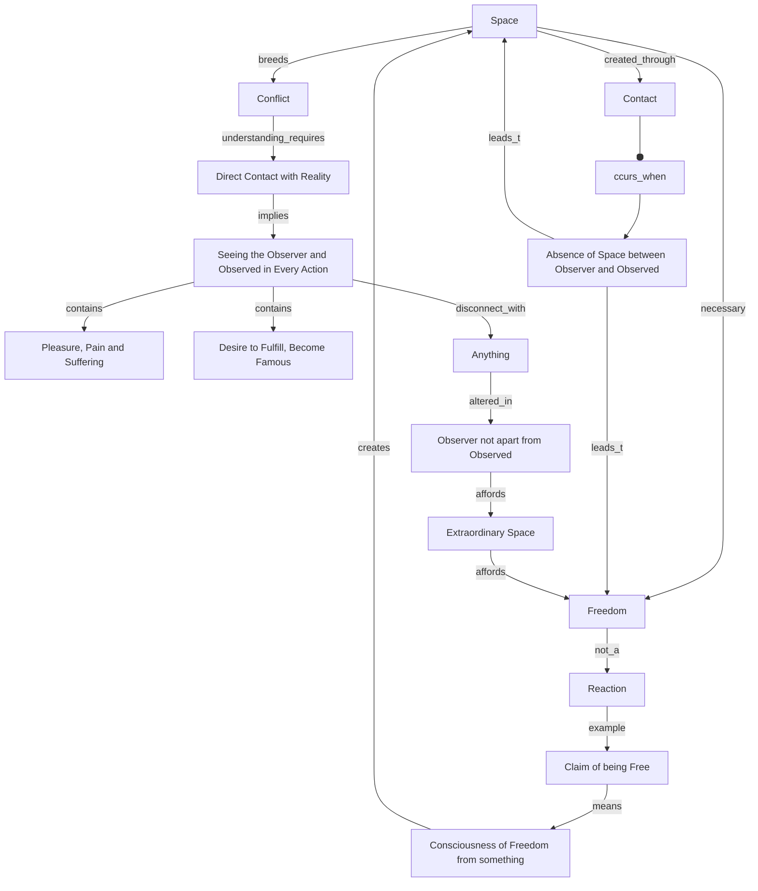

August 18
When the observer is the observed

Create a Mermaid Concept Map Diagram in text format identifying key concepts and keeping their names short  and name their relationships from this corresponding underlying text below from Jiddu Krishnamurti,  do not provide explanations or any further list or notes, only provide this Mermaid Concept Map Diagram in text format.

Space is necessary. Without space there is no freedom. We are talking psychologically...It is only when one is in contact, when there is no space between the observer and the observed that one is in total relationship —with a tree for instance. One is not identified with the tree, the flower, a woman, a man or whatever it is, but when there is this complete absence of space as the observer and the observed, then there is vast space. In that space there is no conflict; in that space there is freedom.
Freedom is not a reaction. You cannot say, “Well, I am free.” The moment you say you are free you are not free, because you are conscious of yourself as being free from something, and therefore you have the same situation as an observer observing a tree. He has created a space, and in that space he breeds conflict. To understand this requires not intellectual agreement or disagreement, or saying, “I don’t understand,” but rather it requires coming directly into contact with what is. It means seeing that all your actions, every moment of action is of the observer and the observed, and within that space there is pleasure, pain and suffering the desire to fulfill, to become famous. Within that space there is no contact with anything. Contact, relationship has a quite different meaning when the observer is no longer apart from the observed. There is this extraordinary space, and there is freedom.

