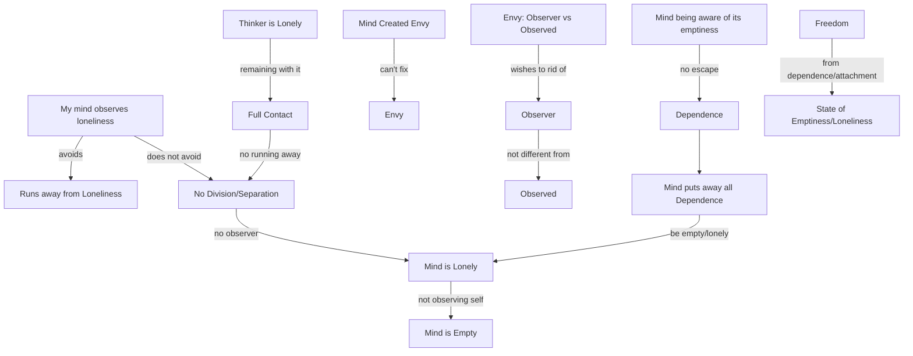

August 19
Is there an observer watching loneliness?

My mind observes loneliness, and avoids it, runs away from it. But if I do not run away from it, is there a division, is there a separation, is there an observer watching loneliness? Or, is there only a state of loneliness, my mind itself being empty, lonely? Not that there is an observer who knows that there is loneliness. I think this is important to grasp, swiftly, not verbalizing too much. We say now , I am envious, and I want to get rid of envy, so there is an observer and the observed; the observer wishes to get rid of that which he observes. But is the observer not the same as the observed? It is the mind itself that has created the envy, and so the mind cannot do anything about envy. So, my mind observes loneliness; the thinker is aware that he is lonely But by remaining with it, being fully in contact, which is, not to run away from it, not to translate and all the rest of it, then, is there a difference between the observer and the observed? Or is there only one state, which is, the mind itself is lonely, empty? Not that the mind observes itself as being empty, but mind itself is empty. Then, can the mind, being aware that it itself is empty, and that whatever its endeavor, any movement away from that emptiness is merely an escape, a dependence, can the mind put away all dependence and be what it is, completely empty, completely lonely? And if it is in that state, is there not freedom from all dependence, from all attachment?
