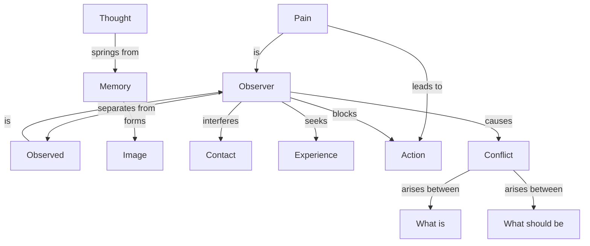

August 21 
Immediate action

If you are in contact with anything, with your wife, with your children, with the sky, with the clouds, with any fact, the moment thought interferes with it you lose contact. Thought springs from memory. Memory is the image, and from there you look and therefore there is a separation between the observer and the observed.
You have to understand this very deeply. It is this separation of the observer from the observed that makes the observer want more experience, more sensatio ns, and so he is everlastingly pursuing, seeking. It has to be completely and totally understood that aslong as there is an observer, the one that is seeking experience, the censor, the entity that evaluates, judges, condemns, there is no immediate contact with what is. When you have pain, physical pain, there is direct perception; there is not the observer who is feeling the pain; there is only pain. Because there is no observer there is immediate action. There is not the idea and then action, but there is only action when there is pain, because there is a direct physical contact. The pain is you; there is pain. As long as this is not completely understood, realized, explored and felt deeply, as long as it is not wholly grasped, not intellectually, not verbally, that the observer is the observed, all life becomes conflict, a contradiction between opposing desires, the “what should be” and the “what is.” You can do this only if you are aware whether you are looking at it as an observer, when you look at a flower or a cloud or anything.

