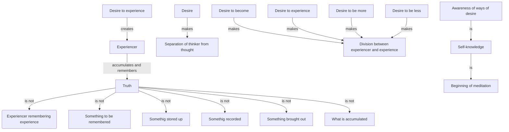

August 20
What is accumulated is not truth

As long as there is the experiencer remembering the experience, truth is not. Truth is not something to be remembered, stored up, recorded, and then brought out. What is accumulated is not truth. The desire to experience creates the experiencer, who then accumulates and remembers. Desire makes for the separation of the thinker from his thought; the desire to become, to experience, to be more or to be less, makes for division between the experiencer and the experience. Awareness of the ways of desire is self- knowledge. Self-knowledge is the beginning of meditation.

