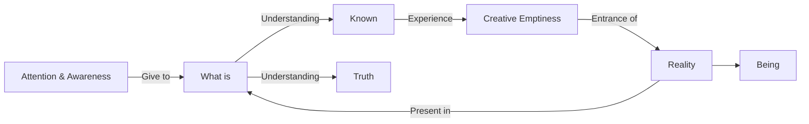

August 22
Reality is in what is

Instead of asking who has realized or what God is why not give your whole attention and awareness to what is? Then you will find the unknown, or rather it will come to you. If you understand what is the known, you will experience that extraordinary silence which is not induced, not enforced, that creative emptiness in which alone reality can enter. It cannot come to that which is becoming, which is striving; it can only come to that which is being, which understands what is. Then you will see that reality is not in the distance; the unknown is not far off; it is in what is. As the answer to a problem is in the problem, so reality is in what is; if we can understand it, then we shall know truth.

