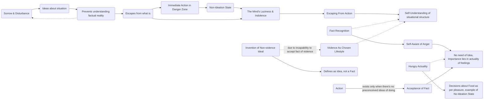

August 23 
Face the fact

I’m in sorrow. Psychologically I’m terribly disturbed; and I have an idea about it, what I should do, what I should not do, how it should be changed. That idea, that formula, that concept prevents me from looking at the fact of what is. Ideation and the formula are escapes from what is. There is immediate action when there is great danger. Then you have no idea. You don’t formulate an idea and then act according to that idea.
The mind has become lazy, indolent through a formula which has given it a means of escape from action with regard to what is. Seeing for ourselves the whole structure of what has been said, not because it has been pointed out to us, is it possible to face the fact, the fact that we are violent, as an example? We are violent human beings, and we have chosen violence as the way of life — war and all the rest of it. Though we talk everlastingly, especially in the East, of nonviolence, we are not nonviolent people; we are violent people. The idea of non violence is an idea, which can be used politically. That’s a different meaning, but it is an idea, and not a fact. Because the human being is incapable of meeting the fact of violence, he has invented the ideal of non violence, which prevents him from dealing with the fact.
After all, the fact is that I’m violent; I’m angry. What is the need of an idea? It is not the idea of being angry; it’s the actual fact of being angry that is important, like the actual fact of being hungry. There’s no idea about being hungry. The idea then comes as to what you should eat, and then according to the dictates of pleasure, you eat. There is only action with regard to what is when there is no idea of what should be done about that which confronts you, which is what is.

