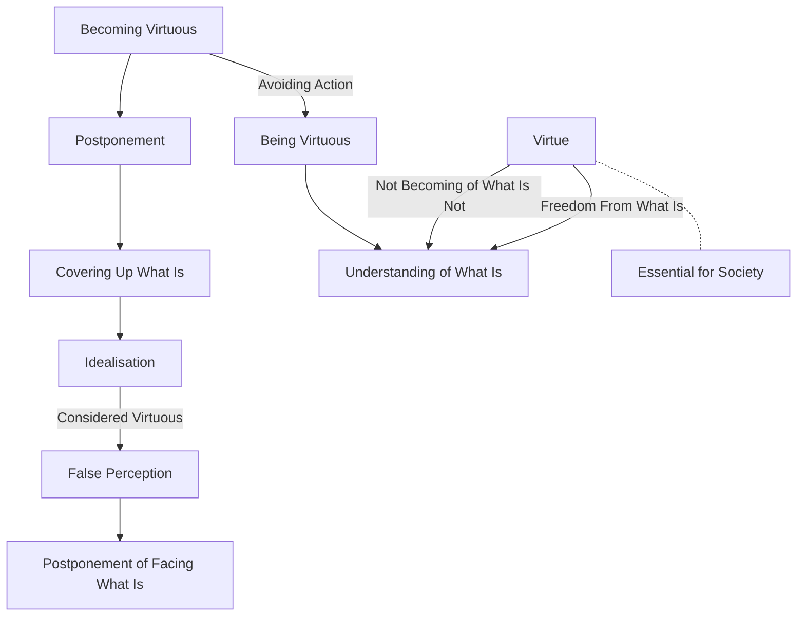

August 24
Freedom from what is

Being virtuous comes through the understanding of what is, whereas becoming virtuous is postponement, the covering up of what is with what you would like to be. Therefore in becoming virtuous you are avoiding action directly upon what is. This process of avoiding what is through the cultivation of the ideal is considered virtuous; but if you look at it closely and directly you will see that it is nothing of the kind. It is merely a postponement of coming face to face with what is. Virtue is not the becoming of what is not; virtue is the understanding of what is and therefore the freedom from what is. Virtue is essential in a society that is rapidly disintegrating.

