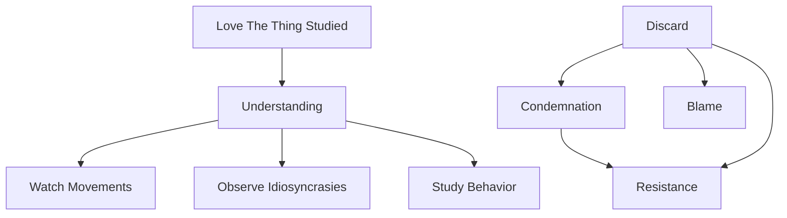

August 25 
Observing thought

I must love the very thing I am studying. If you want to understand a child, you must love and not condemn him. You must play with him, watch his movements, his idiosyncrasies, his ways of behavior; but if you merely condemn, resist or blame him, there is no comprehension of the child. Similarly, to understand what is, one must observe what one thinks, feels and does from moment to moment. That is the actual.

