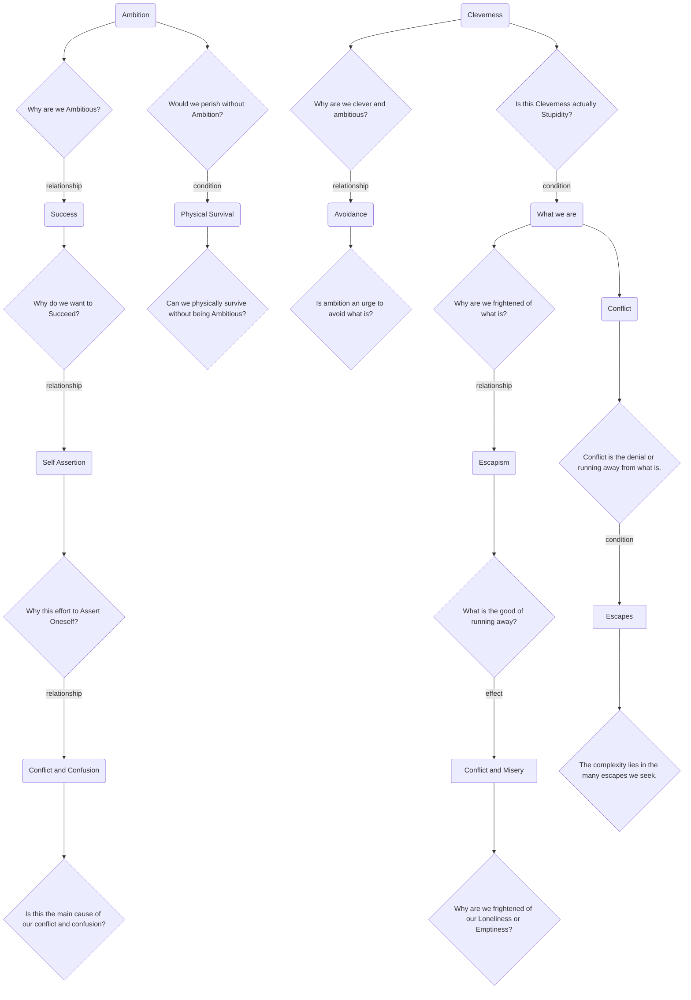

August 26
Escape breeds conflict

Why are we ambitious? Why do we want to succeed, to be somebody? Why do we struggle to be superior? Why all this effort to assert oneself, whether directly, or through an ideology or the State? Is not this self-assertion the main cause of our conflict and confusion? Without ambition, would we perish? Can we not physically survive without being ambitious?
Why are we clever and ambitious? Is not ambition an urge to avoid what is? Is not this cleverness really stupid, which is what we are? Why are we so frightened of what is? What is the good of running away if whatever we are is always there? We may succeed in escaping, but what we are is still there, breeding conflict and misery. Why are we so frightened of our loneliness, or our emptiness? Any activity away from what is is bound to bring sorrow and antagonism. Conflict is the denial of what is or the running away from what is; there is no conflict other than that. Our conflict becomes more and more complex and insoluble because we do not face what is. There is no complexity in what is, but only in the many escapes that we seek.

