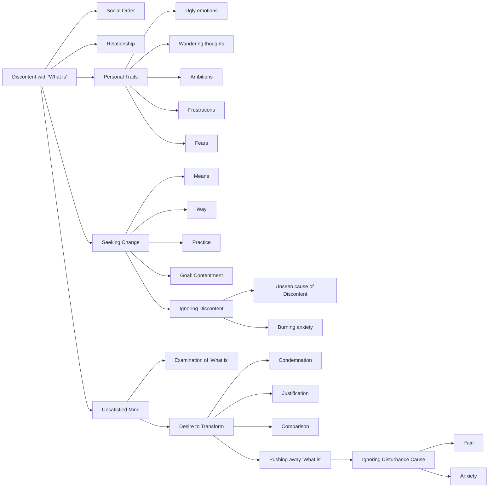

August 27
Discontent has no answer

What is it that we are discontented with? Surely with what is. The what is may be the social order, the what is may be the relationship, the what is may be what we are, the thing we are essentially — which is, the ugly, the wandering thoughts, the ambitions, the frustrations, the innumerable fears; that is what we are. In going away from that, we think we shall find an answer to our discontent. So we are always seeking a way, a means to change the what is — that is what our mind is concerned with. If I am discontent and if I want to find a way, the means to contentment, my mind is occupied with the means, the way and the practicing of the way in order to arrive at contentment. So I am no longer concerned with discontent, with the embers, the flame that is burning, which we call discontent. We do not find out what is behind that discontent. We are only concerned with going away from that flame, from that burning anxiety.
This is enormously difficult because our mind is never satisfied, never content in the examination of what is. It always wants to transform what is into something else — which is the process of condemnation, justification or comparison. If you observe your own mind you will see that when it comes face to face with what is, then it condemns, then it compares it with “what it should be,” or it justifies it and so on, and thereby pushes away what is, setting aside the thing which is causing the disturbance, the pain, the anxiety.

