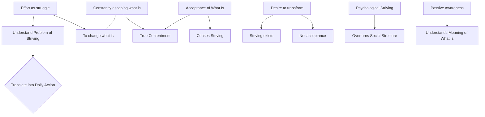

August 28
Effort is distraction from what is

Create a Mermaid Concept Map Diagram in text format identifying key concepts and keeping their names short  and name their relationships from this corresponding underlying text below from Jiddu Krishnamurti,  do not provide explanations or any further list or notes, only provide this Mermaid Concept Map Diagram in text format.

We must understand the problem of striving. If we can understand the significance of effort, then we can translate it into action in our daily life. Does not effort mean a struggle to change what is into what it is not, or what it should be, or what it should become? We are constantly escaping from what is, to transform or modify it. He who is truly content is he who understands what is, who gives the right significance to what is . True contentment lies not in few or many possessions, but in understanding the whole significance of what is. Only in passive awareness is the meaning of what is understood. I am not, at the moment, talking of the physical struggle with the earth, with construction or a technical problem, but of psychological striving. The psychological struggles and problems always overshadow the physiological. You may build a careful social structure, but as long as the psychological darkness and strife are not understood, they invariably overturn the carefully built structure.
Effort is distraction from what is. In the acceptance of what is, striving ceases. There is no acceptance when there is the desire to transform or modify what is. Striving, an indication of destruction, must exist so long as there is a desire to change what is.

