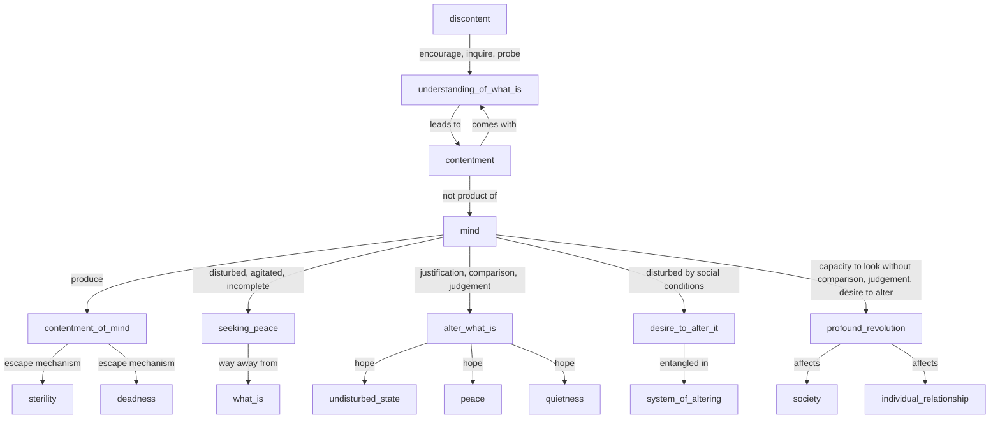

August 29
A contentment not of the mind

Is not discontent essential, not to be smothered away, but to be encouraged, inquired into, probed, so that with the understanding of what is there comes contentment? That contentment is not the contentment which is produced by a system of thought; but it is that contentment which comes with the understanding of what is. That contentment is not the product of the mind — the mind which is disturbed, agitated, incomplete, when it is seeking peace, when it is seeking a way away from what is. And so the mind, through justification, comparison, judgment, tries to alter what is, and thereby hopes to arrive at a state when it will not be disturbed, when it will be peaceful, when there will be quietness. And when the mind is disturbed by social conditions, by poverty, starvation, degradation, by the appalling misery, seeing all that, it wants to alter it; it gets entangled in the way of altering, in the system of altering. But if the mind is capable of looking at what is without comparison, without judgment, without the desire to alter it into something else, then you will see that there comes a kind of contentment which is not of the mind.
The contentment which is the product of the mind is an escape. It is sterile. It is dead. But there is contentment which is not of the mind, which comes into being when there is the understanding of what is, in which there is profound revolution which affects society and individual relationship.

