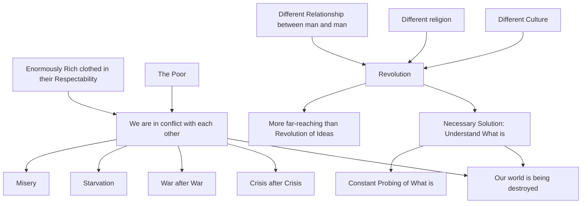

August 31
To understand what is

We are in conflict with each other and our world is being destroyed. There is crisis after crisis, war after war; there is starvation, misery; there are the enormously rich clothed in their respectability, and there are the poor. To solve these problems, what is necessary is not a new system of thought, not a new economic revolution, but to understand what is— the discontent, the constant probing of what is—which will bring about a revolution which is more far-reaching than the revolution of ideas. And it is this revolution that is so necessary to bring about a different culture, a different religion, a different relationship between man and man.

