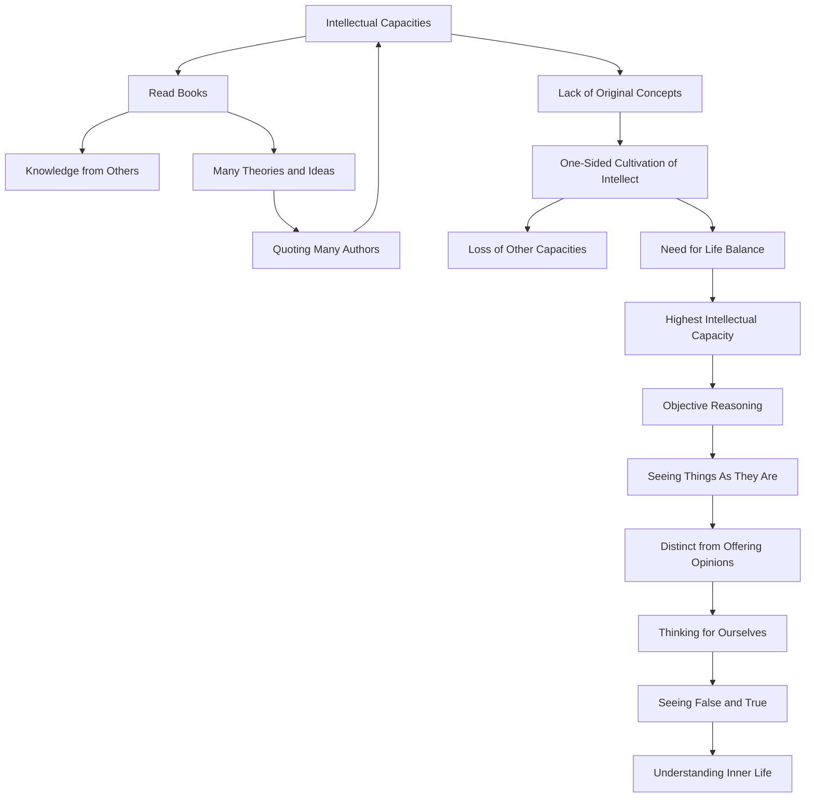

September 1
We think we are intellectual

Most of us have developed intellectual capacities—so-called intellectual capacities, which are not really intellectual capacities at all—we read so many books, filled with what other people have said, their many theories and ideas. We think we are very intellectual if we can quote innumerable books by innumerable authors, if we have read many different varieties of books, and have the capacity to correlate and to explain. But none of us, or very few, have original, intellectual conception. Having cultivated the intellect—so-called—every other capacity, every other feeling, has been lost and we have the problem of how to bring about a balance in our lives so as to have not only the highest intellectual capacity and be able to reason objectively, to see things exactly as they are—not to endlessly to offer opinions about theories and codes, but to think for ourselves, to see for ourselves very closely the false and the true. And this, it seems to me, is one of our difficulties: the incapacity to see, not only outward things, but also such inward life that one has, if one has any at all.

