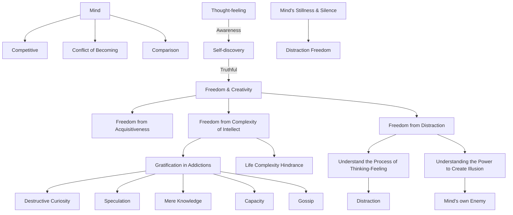

September 2
All thought is distraction

A mind which is competitive, held in the conflict of becoming, thinking in terms of comparison, is not capable of discovering the real. Thought-feeling which is intensely aware is in the process of constant self-discovery—which discovery, being true, is liberating and creative. Such self-discovery brings about freedom from acquisitiveness and from the complex life of the intellect. It is this complex life of the intellect that finds gratification in addictions: destructive curiosity, speculation, mere knowledge, capacity, gossip and so on; and these hindrances prevent simplicity of life. An addiction, a specialization gives sharpness to the mind, a means of focusing thought, but it is not the flowering of thought-feeling into reality.
The freedom from distraction is more difficult as we do not fully understand the process of thinking-feeling which in itself has become the means of distraction. Being ever incomplete, capable of speculative curiosity and formulation, it has the power to create its own hindrances, illusions, which prevent the awareness of the real. So it becomes its own distraction, its own enemy. As the mind is capable of creating illusion, this power must be understood before it can be wholly free from its own self-created distractions. Mind must be utterly still, silent, for all thought becomes a distraction.

