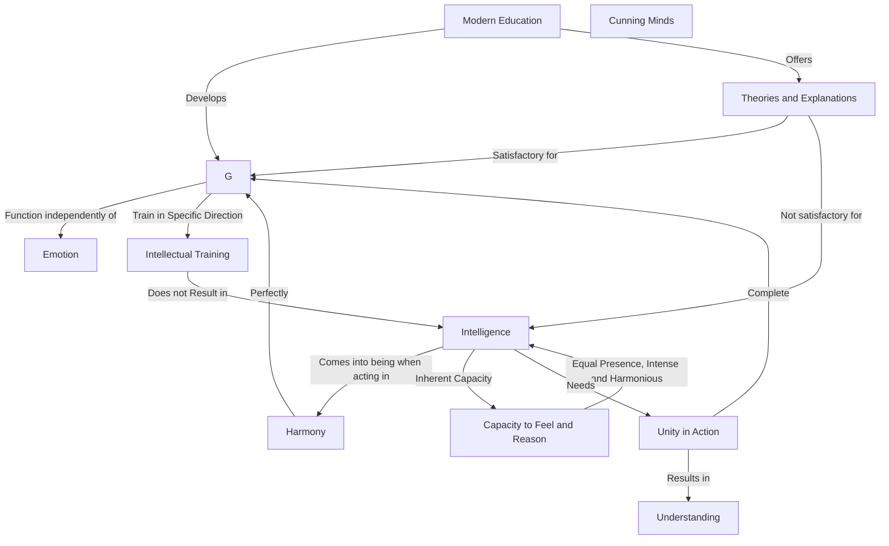

September 3
Unity of mind and heart

Training the intellect does not result in intelligence. Rather, intelligence comes into being when one acts in perfect harmony, both intellectually and emotionally. There is a vast distinction between intellect and intelligence. Intellect is merely thought functioning independently of emotion. When intellect, irrespective of emotion, is trained in any particular direction, one may have great intellect, but one does not have intelligence, because in intelligence there is the inherent capacity to feel as well as to reason; in intelligence both capacities are equally present, intensely and harmoniously.
Now modern education is developing the intellect, offering more and more explanations of life, more and more theories, without the harmonious quality of affection. Therefore we have developed cunning minds to escape from conflict; hence we are satisfied with explanations that scientists and philosophers give us. The mind—the intellect—is satisfied with these innumerable explanations, but intelligence is not, for to understand there must be complete unity of mind and heart in action.

