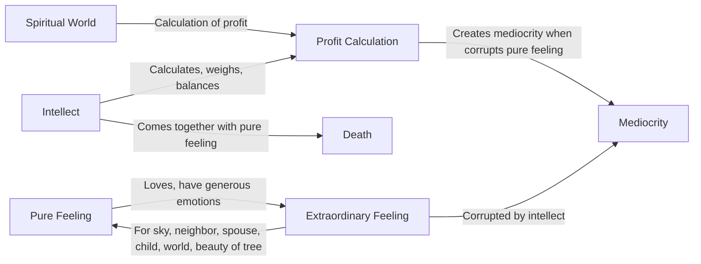

Create a Mermaid Concept Map Diagram in text format identifying key concepts and keeping their names short  and name their relationships from this corresponding underlying text below from Jiddu Krishnamurti,  do not provide explanations or any further list or notes, only provide this Mermaid Concept Map Diagram in text format.

You know, there is the intellect, and there is pure feeling—the pure feeling of loving something, of having great, generous emotions. The intellect reasons, calculates, weighs, balances. It asks, “Is it worthwhile? Will it give me benefit?” On the other hand, there is pure feeling—the extraordinary feeling for the sky, for your neighbor, for your wife or husband, for your child, for the world, for the beauty of a tree, and so on. When these two come together, there is death. Do you understand? When pure feeling is corrupted by the intellect, there is mediocrity. That is what most of us are doing. Our lives are mediocre because we are always calculating, asking ourselves whether it is worthwhile, what profit we will get, not only in the world of money, but also in the so-called spiritual world—“If I do this, will I get that?”

