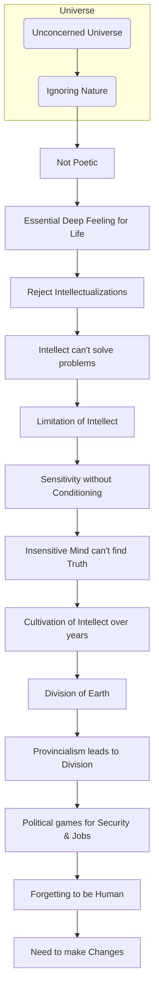

September 5
Intellect will not solve our problems

Most of us are so unconcerned with this extraordinary universe about us; we never even see the waving of the leaf in the wind; we never watch a blade of grass, touch it with our hand and know the quality of its being. This is not just being poetic, so please do not go off into a speculative, emotional state. I say it is essential to have that deep feeling for life and not be caught in intellectual ramifications, discussions, passing examinations, quoting and brushing something new aside by saying it has already been said. Intellect is not the way. Intellect will not solve our problems; the intellect will not give us that nourishment which is imperishable. The intellect can reason, discuss, analyze, come to a conclusion from inferences, and so on, but intellect is limited, for intellect is the result of our conditioning. But sensitivity is not. Sensitivity has no conditioning; it takes you right out of the field of fears and anxieties. The mind that is not sensitive to everything about it — to the mountain, the telegraph pole, the lamp, the voice, the smile, everything — is incapable of finding what is true.But we spend our days and years in cultivating the intellect, in arguing, discussing, fighting, struggling to be something, and so on. And yet this extraordinarily wonderful world, this earth that is so rich — not the Bombay earth, the Punjab earth, the Russian earth or the American earth — this earth is ours, yours and mine, and that is not sentimental nonsense; it is a fact. But unfortunately we have divided it up through our pettiness, through our provincialism. And we know why we have done it — for our security, for better jobs and more jobs. That is the political game that is being played throughout the world, and so we forget to be human beings, to live happily on this earth which is ours and to make something of it.

