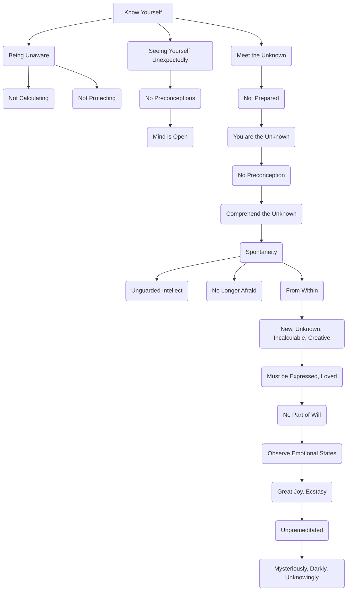

September 7
The unguarded intellect

You can know yourself only when you are unaware, when you are not calculating, not protecting, not constantly watching to guide, to transform, to subdue, to control; when you see yourself unexpectedly, that is, when the mind has no preconceptions with regard to itself, when the mind is open, unprepared to meet the unknown.
If your mind is prepared, surely you cannot know the unknown, for you are the unknown. If you say to yourself, “I am God,” or “I am nothing but a mass of social influences or a bundle of qualities” — if you have any preconception of yourself, you cannot comprehend the unknown, that which is spontaneous.So spontaneity can come only when the intellect is unguarded, when it is not protecting itself, when it is no longer afraid for itself; and this can happen only from within. That is, the spontaneous must be the new, the unknown, the incalculable, the creative, that which must be expressed, loved, in which the will as the process of intellect, controlling, directing, has no part. Observe your own emotional states and you will see that the moments of great joy, great ecstasy, are unpremeditated; they happen, mysteriously, darkly, unknowingly.

