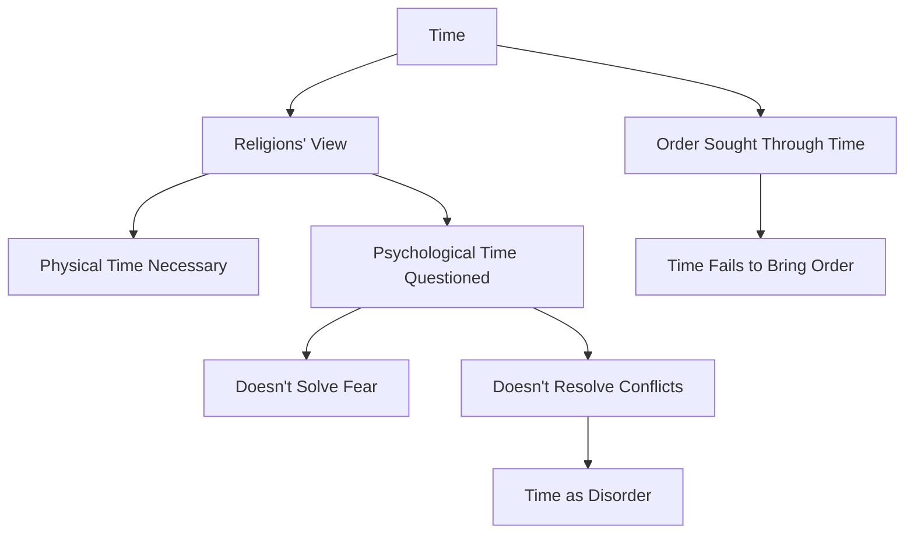

October 1
Time provides no solution

All religions have maintained that time is necessary, the psychological time we are talking about. Heaven is very far away, and one can only come to it through the gradual process of evolution, through suppression, through growth, or through identification with an object, with something superior. Our question is whether it is possible to be free of fear immediately. Otherwise fear breeds disorder; psychological time invariably does breed extraordinary disorder within one.
I am questioning the whole idea of evolution, not of the physical being, but of thought which has identified itself with a particular form of existence in time. The brain has obviously evolved to come to this present stage, and it may evolve still further, expand still more. But as a human being, I have lived for forty or fifty years in a world made up of all kinds of theories, conflicts, and concepts; in a society in whic h greed, envy, and competition have bred wars. I am a part of all that. To a man who is in sorrow, there is no significance in looking to time for a solution, in evolving slowly for the next two million years as a human being. Constituted as we are, is it possible to be free from fear and from psychological time? Physical time must exist; you can’t get away from that. The question is whether psychological time can bring not only order within the individual but alsosocial order. We are part of society; we are not separate. Where there is order in a human being, there will inevitably be social order outwardly.

