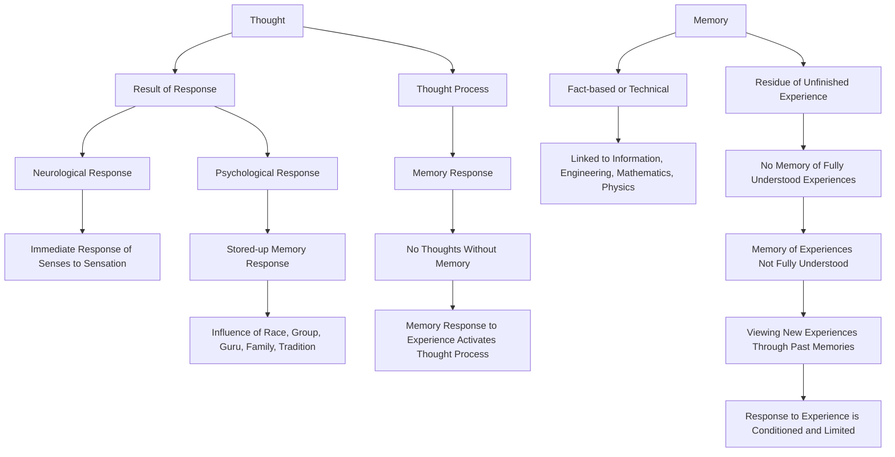

September 8
Memory has no life in itself

What do we mean by thought? When do you think? Obviously, thought is the result of a response, neurological or psychological, is it not? It is the immediate response of the senses to a sensation, or it is psychological, the response of stored-up memory. There is the immediate response of the nerves to a sensation, and there is the psychological response of stored-up memory, the influence of race, group, guru, family, tradition, and so on — all of which you call thought. So, the thought process is the response of memory, is it not? You would have no thoughts if you had no memory, and the response of memory to a certain experience brings the thought process into action.
What, then, is memory? If you observe your own memory and how you gather memory, you will notice that it is either factual, technical, having to do with information, with engineering, mathematics, physics, and all the rest of it— or, it is the residue of an unfinished, uncompleted experience, is it not? Watch your own memory and you will see. When you finish an experience, complete it, there is no memory of that experience in the sense of a psychological residue. There is a residue only when an experience is not fully understood, and there is no understanding of experience because we look at each experience through past memories, and therefore we never meet the new as the new, but always through the screen of the old. Therefore, it is clear that our response to experience is conditioned, always limited.

