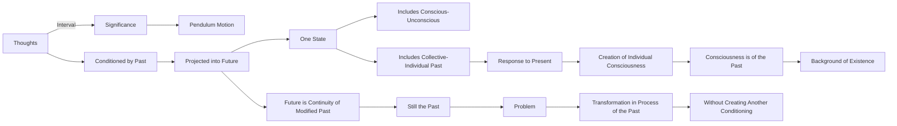

September 9
Consciousness is of the past

If you watch very carefully you will see that it is not a constant but that there is an interval between two thoughts; though it may be but an infinitesimal fraction of a second, there is an interval that has significance in the swinging backwards and forwards of the pendulum. We see the fact that our thinking is conditioned by the past which is projected into the future; the moment you admit the past, you must also admit the future, because there are not two such states as the past and the future but one state which includes both the conscious and the unconscious, both the collective past and the individual past. The collective and the individual past, in response to the present, give out certain responses which create the individual consciousness; therefore consciousness is of the past and that is the whole background of our existence. The moment you have the past, you inevitably have the future, because the future is merely the continuity of the modified past but it isstill the past, so our problem is how to bring about a transformation in this process of the past without creating another conditioning, another past.

