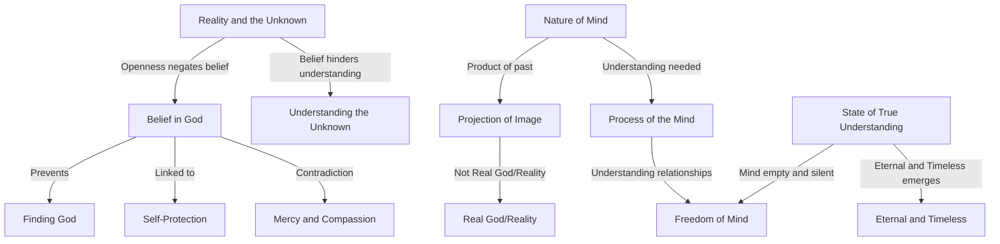

Create a Mermaid diagram in text format, identifying key concepts, keep their names short,  breaking down these concepts  and their interrelations from the given text based on Jiddu Krishnamurti talks:

A man who believes in God can never find God. If you are open to reality, there can be no belief in reality. If you are open to the unknown, there can be no belief in it. After all, belief is a form of self-protection, and only a petty mind can believe in God. Look at the belief of the aviators during the war who said God was their companion as they were dropping bombs! So you believe in God when you kill, when you are exploiting people. You worship God and go on ruthlessly extorting money, supporting the army—yet you say you believe in mercy, compassion, kindliness. ...As long as belief exists, there can never be the unknown; you cannot think about the unknown, thought cannot measure it. The mind is the product of the past, it is the result of yesterday, and can such a mind be open to the unknown? It can only project an image, but that projection is not real; so your god is not God—it is an image of your own making, an image of your own gratification. There can be reality only when the mind understands the total process of itself and comes to an end. When the mind is completely empty—only then is it capable of receiving the unknown. The mind is not purged until it understands the content of relationship—its relationship with property, with people—until it has established the right relationship with everything. Until it understands the whole process of conflict in relationship, the mindcannot be free. Only when the mind is wholly silent, completely inactive, not projecting, when it is not seeking and is utterly still—only then that which is eternal and timeless comes into being.

Creating a Mermaid diagram from Jiddu Krishnamurti's text involves breaking down the key concepts and their relationships. The text discusses themes like belief, reality, the unknown, the mind, and the nature of God. Here's a conceptual breakdown:

1. Belief in God
   - Leads to a lack of finding God
   - Associated with self-protection
   - Example: Aviators during war believing in God while contradicting the principles of mercy and compassion

2. Reality and the Unknown
   - Openness to reality excludes belief
   - Openness to the unknown negates belief in it
   - Belief prevents understanding of the unknown

3. Nature of Mind
   - Product of the past and experiences
   - Capable of only projecting its own image
   - This projection is not the real God or reality

4. Process of the Mind
   - Understanding its own process is crucial
   - Relationship with property, people, and conflict
   - Must be purged and understood for freedom

5. State of True Understanding
   - Achieved when the mind is empty and silent
   - Inactive and not projecting
   - This state allows the eternal and timeless to emerge

Based on these concepts, a Mermaid diagram could be constructed as follows:

This diagram shows the relationships between the key concepts discussed in the text, illustrating how belief in God can hinder the understanding of reality and the unknown, the nature of the mind and its processes, and the state of true understanding where the eternal and timeless can be realized.
