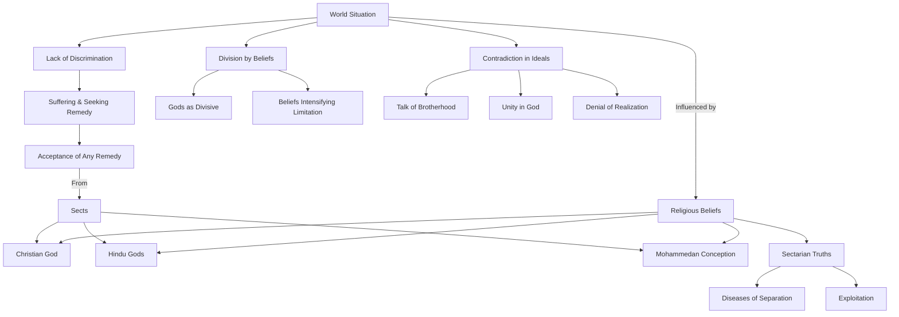

Create a Mermaid diagram in text format, identifying key concepts, keep their names short,  breaking down these concepts  and their interrelations from the given text based on Jiddu Krishnamurti talks:

What is happening in the world? You have a Christian God, Hindu Gods, Mohammedans with their particular conception of God—each little sect with their particular truth; and all these truths are becoming like so many diseases in the world, separating people. These truths, in the hands of the few, are becoming the means of exploitation. You go to each, one after the other, tasting them all, because you begin to lose all sense of discrimination, because you are suffering and you want a remedy, and you accept any remedy that is offered by any sect, whether Christian, Hindu, or any other sect. So, what is happening? Your Gods are dividing you, your beliefs in God are dividing you and yet you talk about the brotherhood of man, unity in God, and at the same time deny the very thing that you want to find out, because you cling to these
beliefs as the most potent means of destroying limitation, whereas they but intensify it. These things are so obvious.

To create a Mermaid diagram in text format based on the provided text, I'll break down the key concepts and their interrelations as discussed in Jiddu Krishnamurti's talks. I will keep the names of the concepts short for clarity.

Explanation:
A (World Situation): Represents the overall context of the discussion.
B (Religious Beliefs): Central to the discussion, influencing various aspects.
C, D, E (Christian God, Hindu Gods, Mohammedan Conception): Different religious entities contributing to the situation.
F (Sectarian Truths): Represents the specific truths held by various sects.
G (Diseases of Separation) and H (Exploitation): Negative consequences of sectarian truths.
I (Lack of Discrimination): A state resulting from suffering and seeking remedies.
J (Suffering & Seeking Remedy): The human condition leading to acceptance of solutions.
K (Acceptance of Any Remedy): The outcome of seeking solutions indiscriminately.
L (Sects): Various religious sects offering remedies.
M (Division by Beliefs): The divisive effect of religious beliefs.
N (Gods as Divisive) and O (Beliefs Intensifying Limitation): Further elucidation of the divisive nature of beliefs.
P (Contradiction in Ideals): Highlights the contradiction in seeking unity while holding divisive beliefs.
Q (Talk of Brotherhood), R (Unity in God), and S (Denial of Realization): Ideals in contradiction with the reality of division and limitation. 

This diagram aims to visually represent the complex interplay of religious beliefs, societal divisions, and the quest for understanding as discussed in Krishnamurti's talks.