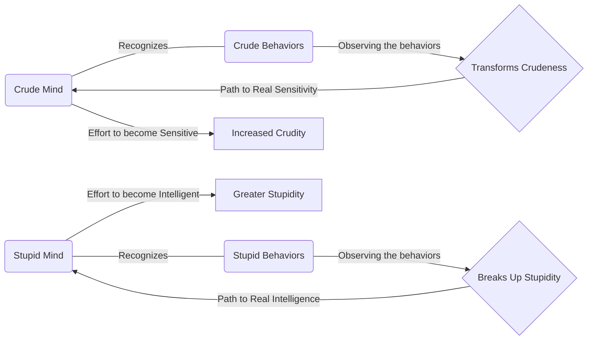

February 3
Can the crude mind become sensitive?

Listen to the question, to the meaning behind the words. Can the crude mind become sensitive? If I say my mind is crude and I try to become sensitive, the very effort to become sensitive is crudity. Please see this. Don’t be intrigued, but watch it. Whereas, if I recognize that I am crude without wanting to change, without trying to become sensitive, if I begin to understand what crudeness is, observe it in my life from day to day—the greedy way I eat, the roughness with which I treat people, the pride, the arrogance, the coarseness of my habits and thoughts—then that very observation transforms what is.
Similarly, if I am stupid and I say I must become intelligent, the effort to become intelligent is only a greater form of stupidity; because what is important is to understand stupidity. However much I may try to become intelligent, my stupidity will remain. I may acquire the superficial polish of learning, I may be able to quote books, repeat passages from great authors, but basically I shall still be stupid. But if I see and understand stupidity as it expresses itself in my daily life—how I behave towards my servant, how I regard my neighbor, the poor man, the rich man, the clerk—then that very awareness brings about a breaking up of stupidity.

