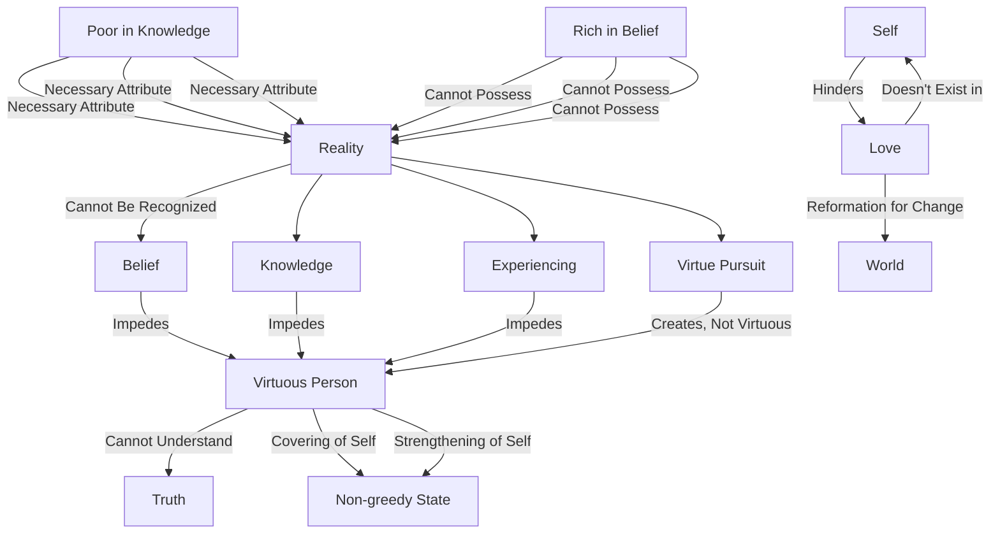

February 7
When there is love, self is not

Reality, truth, is not to be recognized. For truth to come, belief, knowledge, experiencing, virtue, pursuit of virtue—which is different from being virtuous—all this must go. The virtuous person who is conscious of pursuing virtue can never find reality. He may be a very decent person; that is entirely different from the man of truth, from the man who understands. To the man of truth, truth has come into being. A virtuous man is a
righteous man, and a righteous man can never understand what is truth; because virtue to him is the covering of the self, the strengthening of the self; because he is pursuing virtue. When he says “I must be without greed,” the state in which he is non- greedy and which he experiences, strengthens the self. That is why it is so important to be poor, not only in the things of the world, but also in belief and in knowledge. A man rich with worldly riches, or a man rich in knowledge and belief, will never know anything but darkness, and will be the center of all mischief and misery. But if you and I, as individuals, can see this whole working of the self, then we shall know what love is. I assure you that is the only reformation which can possibly change the world. Love is not the self. Self cannot recognize love. You say “I love,” but then, in the very saying of it, in the very experiencing of it, love is not. But, when you know love, self is not. When there is love, self is not.

