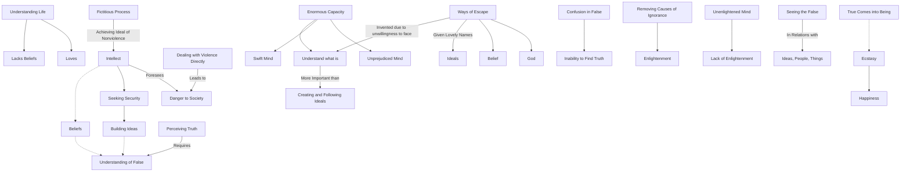

February 8
Understanding what is

Surely, a man who is understanding life does not want beliefs. A man who loves, has no beliefs—he loves. It is the man who is consumed by the intellect who has beliefs, because intellect is always seeking security, protection; it is always avoiding danger, and therefore it builds ideas, beliefs, ideals, behind which it can take shelter. What would happen if you dealt with violence directly, now? You would be a danger to society; and because the mind foresees the danger, it says "I will achieve the ideal of nonviolence ten years later which is such a fictitious, false process...” To understand what is, is more important than to create and follow ideals because ideals are false, and wha t is is the real. To understand what is requires an enormous capacity, a swift and unprejudiced mind. It is because we don’t want to face and understand what is that we invent the many ways of escape and give them lovely names as the ideal, the belief, God. Surely, it is only when I see the false as the false that my mind is capable of perceiving what is true. A mind that is confused in the false, can never find the truth. Therefore, I must understand what is false in my relationships, in my ideas, in the things about me because to perceive the truth requires the understanding of the false. Without removing the causes of ignorance, there cannot be enlightenment; and to seek enlightenment when the mind is unenlightened is utterly empty, meaningless. Therefore, I must begin to see the false in my relationships with ideas, with people, with things. When the mind sees that which is false, then that which is true comes into being and then there is ecstasy, there is happiness.

