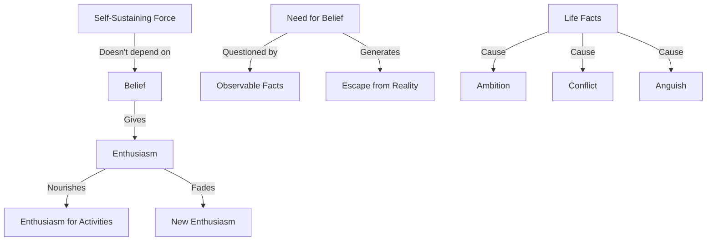

February 9
What we believe

Create a Mermaid Concept Map Diagram in text format identifying key concepts and keeping their names short  and name their relationships from this corresponding underlying text below from Jiddu Krishnamurti,  do not provide explanations or any further list or notes, only provide this Mermaid Concept Map Diagram in text format.

Does belief give enthusiasm? Can enthusiasm sustain itself without a belief, and is enthusiasm at all necessary, or is a different kind of energy needed, a different kind of vitality, drive? Most of us have enthusiasm for something or other. We are very keen, very enthusiastic about concerts, about physical exercise, or going to a picnic. Unless it is nourished all the time by something or other, it fades away and we ha ve a new enthusiasm for other things. Is there a self-sustaining force, energy, which doesn’t depend on a belief?
The other question is: Do we need a belief of any kind, and if we do, why is it necessary? That’s one of the problems involved. We don’t need a belief that there is sunshine, the mountains, the rivers. We don’t need a belief that we and our wives quarrel. We don’t have to have a belief that life is a terrible misery with its anguish, conflict, and constant ambition; it is a fact. But we demand a belief when we want to escape from a fact into an unreality.

