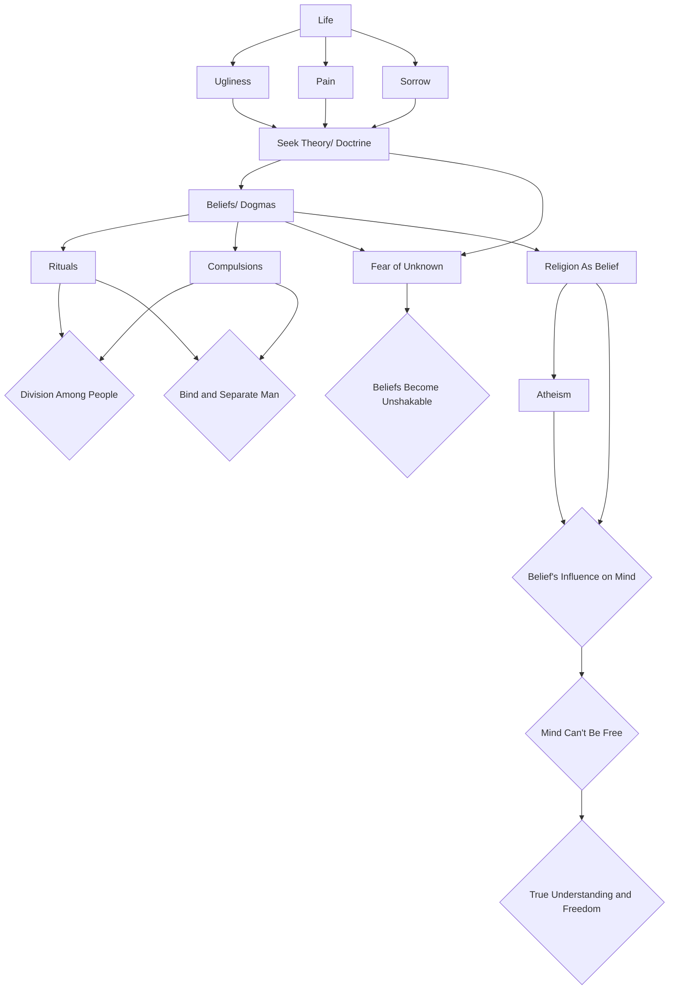

February 11
Beyond belief

We realize that life is ugly, painful, sorrowful; we want some kind of theory, some kind of speculation or satisfaction, some kind of doctrine, which will explain all this, and so we are caught in explanation, in words, in theories, and gradually, beliefs become deeply rooted and unshakable because behind those beliefs, behind those dogmas, there is the constant fear of the unknown. But we never look at that fear; we turn away from it. The stronger the beliefs, the stronger the dogmas. And when we examine these beliefs—the Christian, the Hindu, the Buddhist—we find that they divide people. Each dogma, each belief has a series of rituals, a series of compulsions which bind man and separate man. So, we start with an inquiry to find out what is true, what the significance is of this misery, this struggle, this pain; and we are soon caught up in beliefs, in rituals, in theories.
Belief is corruption because, behind belief and morality lurks the mind, the self the self growing big, powerful and strong. We consider belief in God, the belief in something, as religion. We consider that to believe is to be religious. You understand? If you do not believe, you will be considered an atheist, you will be condemned by society. One society will condemn those who believe in God, and another society will condemn those who do not. They are both the same. So, religion becomes a matter of belief—and belief acts and has a corresponding influence on the mind; the mind then can never be free. But it is only in freedom that you can find out what is true, what is God, not through any belief, because your very belief projects what you think ought to be God, what you think ought to be true.

