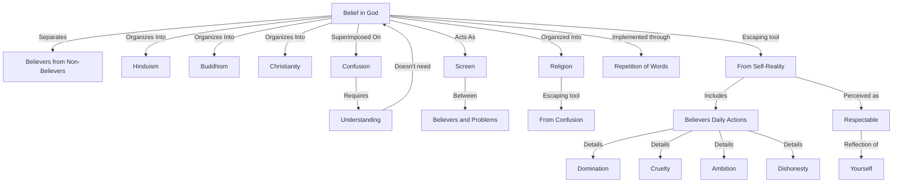

February 12
The screen of belief

You believe in God, and another does not believe in God, so your beliefs separate you from each other. Belief throughout the world is organized as Hinduism, Buddhism, or Christianity, and so it divides man from man. We are confused, and we think that through belief we shall clear the confusion; that is, belief is superimposed on the confusion, and we hope that confusion will thereby be cleared away. But belief is merely an escape from the fact of confusion; it does not help us to face and to understand the fact but to run away from the confusion in which we are. To understand the confusion, belief is not necessary, and belief only acts as a screen between ourselves and our problems. So, religion, which is organized belief, becomes a means of escape from what is, from the fact of confusion. The man who believes in God, the man who believes in the hereafter, or who has any other form of belief, is escaping from the fact of what he is. Do you not know those who believe in God, who do puja, who repeat certain chants and words, and who in their daily life are dominating, cruel, ambitious, cheating, dishonest? Shall they find God? Are they really seeking God? Is God to be found through repetition of words, through belief? But such people believe in God, they worship God, they go to the temple every day, they do everything to avo id the fact of what they are—and such people you consider respectable because they are yourself.

