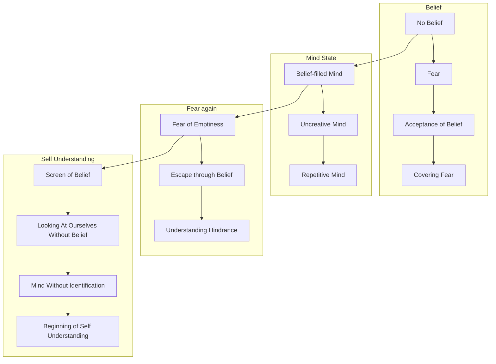

February 14
Belief hinders true understanding

If we had no belief, what would happen to us? Shouldn’t we be very frightened of what might happen? If we had no pattern of action, based on a belief—either in God, or in communism, or in socialism, or in imperialism, or in some kind of religious formula, some dogma in which we are conditioned—we should feel utterly lost, shouldn’t we? And is not this acceptance of a belief the covering up of that fear—the fear of being really nothing, of being empty? After all, a cup is useful only when it is empty; and a mind that is filled with beliefs, with dogmas, with assertions, with quotations, is really an uncreative mind; it is merely a repetitive mind. To escape from that fear—that fear of emptiness, that fear of loneliness, that fear of stagnation, of not arriving, not succeeding, not achieving, not being something, not becoming something—is surely one of the reasons, is it not, why we accept beliefs so eagerly and greedily? And, through acceptance of belief, do we understand ourselves? On the contrary. A belief, religious or political, obviously hinders the understanding of ourselves. It acts as a screen through which we look at ourselves. And can we look at ourselves without beliefs? If we remove these beliefs, the many beliefs that one has, is there anything left to look at? If we have no beliefs with which the mind has identified itself, then the mind, without identification, is capable of looking at itself as it is—and then, surely there is the beginning of the understand of oneself.

