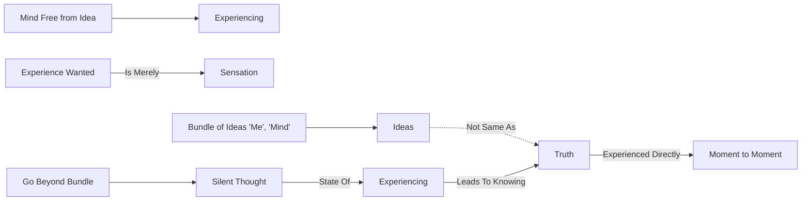

February 16
Action without idea

Create a Mermaid Concept Map Diagram in text format identifying key concepts and keeping their names short  and name their relationships from this corresponding underlying text below from Jiddu Krishnamurti,  do not provide explanations or any further list or notes, only provide this Mermaid Concept Map Diagram in text format.

It is only when the mind is free from idea that there can be experiencing. Ideas are not truth; and truth is something that must be experienced directly, from moment to moment. It is not an experience which you want—which is then merely sensation. Only when one can go beyond the bundle of ideas—which is the me, which is the mind, which has a partial or complete continuity only when one can go beyond that, when thought is completely silent, is there a state of experiencing. Then one shall know what truth is.

