February 17
Action without the process of thought

What do we mean by idea? Surely idea is the process of thought. Is it not? Idea is a process of mentation, of thinking; and thinking is always a reaction either of the conscious or of the unconscious. Thinking is a process of verbalization which is the result of memory; thinking is a process of time. So, when action is based on the process of thinking, such action must inevitably be conditioned, isolated. Idea must oppose idea, idea must be dominated by idea. There is a gap then between action and idea. What we are trying to find out is whether it is possible for action to be without idea. We see how idea separates people. As I have already explained, knowledge and belief are essentially separating qualities. Beliefs never bind people; they always separate people; when action is based on belief or an idea or an ideal, such an action must inevitably be isolated, fragmented. Is it possible to act without the process of thought, thought being a process of time, a process of calculation, a process of self-protection, a process of belief, denial, condemnation, justification. Surely, it must have occurred to you as it has to me, whether action is at all possible without idea.

```mermaid
graph LR
A[Idea] --> B[Process of Thought]
B --> C[Reaction of Conscious or Unconscious]
B --> D[Verbalization Result of Memory]
D --> E[Thinking]
E --> F[Process of Time]
F --> G[Conditioned and Isolated Action]
G --> H[Idea Opposes or Dominates Idea]
H --> I[Gap between Action and Idea]
I --> J[Potential for Action without Idea]
J --> K[Division through Idea]
K --> L[Knowledge and Belief as Separating Qualities]
L --> M[Fragmented and Isolated Action based on Ideals or Beliefs]
M --> N[Potential for Action without Thought]
N --> O[Thinking as a Process of Time, Calculation, Self-Protection, Belief, Denial, Condemnation, Justification]
```

