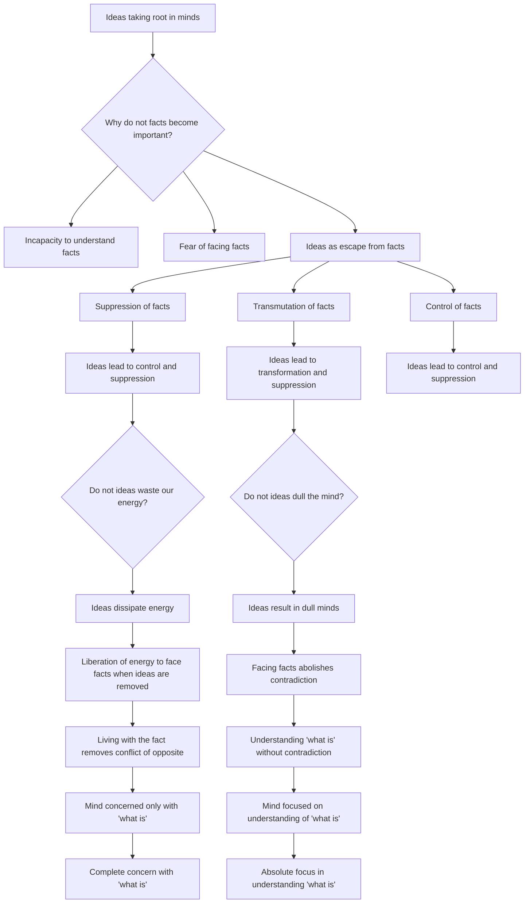

February 15
Direct observation

Why do ideas take root in our minds? Why do not facts become all-important—not ideas? Why do theories, ideas, become so significant rather than the fact? Is it that we cannot understand the fact, or have not the capacity, or are afraid of facing the fact? Therefore, ideas, speculations, theories are a means of escaping away from the fact...
You may run away, you may do all kinds of things; the facts are there the fact that one is angry, the fact that one is ambitious, the fact that one is sexual, a dozen things. You may suppress them, you may transmute them, which is another form of suppression; you may control them, but they are all suppressed, controlled, disciplined with ideas...Do not ideaswaste our energy? Do not ideas dull the mind? You may be clever in speculation, in quotations; but it is obviously a dull mind which quotes, that has read a lot and quotes.
...You remove the conflict of the opposite at one stroke if you live with the fact and therefore liberate the energy to face the fact. For most of us, contradiction is an extraordinary field in which the mind is caught. I want to do this, and I do something entirely different; but if I face the fact of wanting to do this, there is no contradiction; and therefore, at one stroke I abolish altogether all sense of the opposite, and my mind then is completely concerned with what is, and with the understanding of what is.

