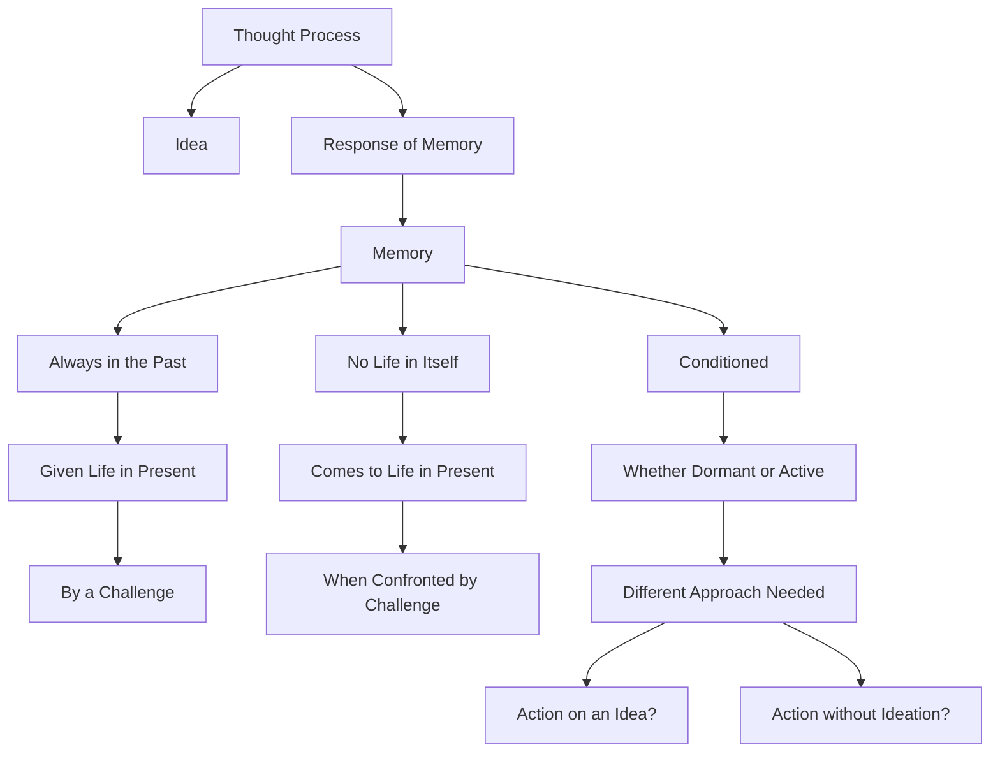

February 20
Action without ideation

The idea is the result of the thought process, the thought process is the response of memory, and memory is always conditioned. Memory is always in the past, and that memory is given life in the present by a challenge. Memory has no life in itself; it comes to life in the present when confronted by a challenge. And all memory, whether dormant or active, is conditioned, is it not? Therefore there has to be quite a different approach. You have to find out for yourself, inwardly, whether you are acting on an idea, and if there can be action without ideation.

