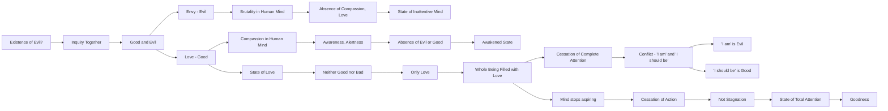

February 22
Conflict of the opposites

I wonder if there is such a thing as evil? Please give your attention, go with me, let us inquire together. We say there is good and evil. There is envy and love, and we say that envy is evil and love is good. Why do we divide life, calling this good and that bad, thereby creating the conflict of the opposites? Not that there is not envy, hate, brutality in the human mind and heart, an absence of compassion, love, but why do we divide life into the thing called good and the thing called evil? Is there not actually only one thing, which is a mind that is inattentive? Surely, when there is complete attention, that is, when the mind is totally aware, alert, watchful, there is no such thing as evil or good; there is only an awakened state. Goodness then is not a quality, not a virtue, it is a state of love. When there is love, there is neither good nor bad, there is only love. When you really love somebody, you are not thinking of good or bad, your whole being is filled with that love. It is only when there is the cessation of complete attention, of love, that there comes the conflict between what I am and what I should be. Then that which I am is evil, and that which I should be is the so called good.
You watch your own mind and you will see that the moment the mind ceases to think in terms of becoming something, there is a cessation of action which is not stagnation; it is a state of total attention, which is goodness.

