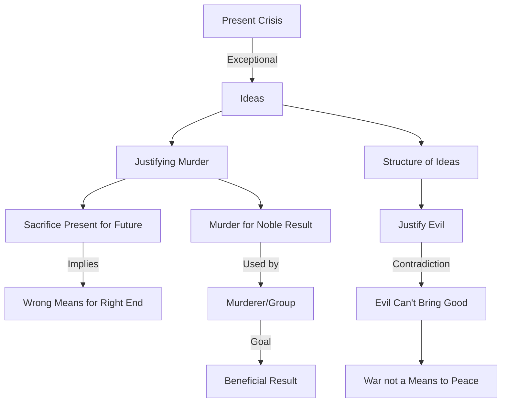

February 24
Justifying evil

Obviously the present crisis throughout the world is exceptional, without precedent. There have been crises of varying types at different periods throughout history—social, national, political. Crises come and go; economic recessions, depressions, come, get modified, and continue in a different form. We know that; we are familiar with that process. Surely the present crisis is different, is it not? It is different first because we are dealing not with money nor with tangible things but with ideas. The crisis is exceptional because it is in the field of ideation. We are quarreling with ideas, we are justifying murder; everywhere in the world we are justifying murder as a means to a righteous end, which in itself is unprecedented. Before, evil was recognized to be evil, murder was recognized to be murder, but now murder is a means to achieve a noble result. Murder, whether of one person or of a group of people, is justified, because the murderer, or the group that the murderer represent, justifies it as a means of achieving a result that will be beneficial to man. That is we sacrifice the present for the future—and it does not matter what means we employ as long as our declared purpose is to produce a result that we say will be beneficial to man. Therefore, the implication is that a wrong means will produce a right end and you justify the wrong means through ideation...We have a magnificent structure of ideas to justify evil and surely that is unprecedented. Evil is evil; it cannot bring about good. War is not a means to peace.

