February 25
Goodness has no motive

If I have a motive to be good, does that bring about goodness? Or is goodness something entirely devoid of this urge to be good, which is ever based on a motive? Is good the opposite of bad, the opposite of evil? Every opposite contains the seed of its own opposite, does it not? There is greed, and there is the ideal of non- greed. When the mind pursues non-greed, when it tries to be non-greedy, it is still greedy because it wants to be something. Greed implies desiring, acquiring, expanding; and when the mind sees that it does not pay to be greedy, it wants to be non-greedy, so the motive is still the same, which is to be or to acquire something. When the mind wants not to want, the root of want, of desire, is still there. So goodness is not the opposite of evil; it is a totally different state. And what is that state?
Obviously, goodness has no motive because all motive is based on the self; it is the egocentric movement of the mind. So what do we mean by goodness? Surely, there is goodness only when there is total attention. Attention has no motive. When there is a motive for attention, is there attention? If I pay attention in order to acquire something, the acquisition, whether it be good or bad, is not attention it is a distraction. A division.There can be goodness only when there is a totality of attention in which there is no effort to be or not to be.

```mermaid
graph TD
    A[Goodness] --> B[Motive to be Good?]
    B --> C[Devoid of Goodness?]
    D[Good] --> E[Opposite of Bad/Evil]
    E --> D[Seed of its Own Opposite]
    F[Greed] --> G[Ideal of Non-Greed]
    G --> H[Greed = Desire to be Something]
    H --> I[Greed = Desire, Acquire, Expand]
    J[Non-Greed Desire] --> K[Same Motive: Be or Acquire Something]
    L[Want Not To Want] --> M[Root of Desire remains]
    N[Goodness ≠ Evil] --> O[Different State]
    P[Goodness] --> Q[No Motive]
    Q --> R[All Motive = Self / Egocentricity]
    S[Goodness] --> T[Exists with Total Attention]
    U[Attention] --> V[No Motive]
    W[Motive for Attention] --> X[Distraction, Not Attention]
    Y[Totality of Attention] --> Z[No Effort to Be]
    Z --> AA[Allows Goodness]
```

