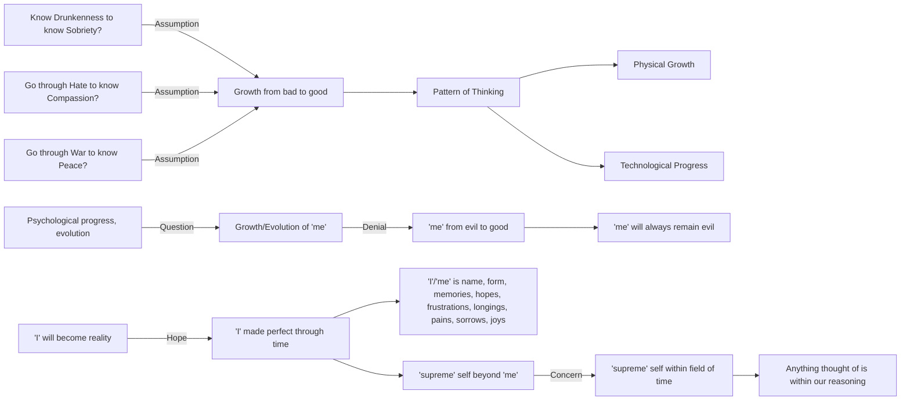

February 26
Human evolution

Must we know drunkenness to know sobriety? Must you go through hate in order to know what it is to be compassionate? Must you go through wars, destroying yourself and others, to know what peace is? Surely, this is an utterly false way of thinking, is it not? First you assume that there is evolution, growth, a moving from bad to good, and then you fit your thinking into that pattern. Obviously, there is physical growth, the little plant becoming the big tree; there is technological progress, the wheel evolving through centuries into the jet plane. But is there psychological progress, evolution? That is what we are discussing—whether there is a growth, an evolution of the “me,” beginning with evil and ending up in good. Through a process of evolution, through time, can the “me,” which is the center of evil, ever become noble, good? Obviously not. That which is evil, the psychological “me,” will always remain evil. But we do not want to face that. We think that through the process of time, through growth and change, the “I” will ultimately become reality. This is our hope, that is our longing—that the “I” will be made perfect through time. What is this “I,” this “me”? It is a name, a form, a bundle of memories, hopes, frustrations, longings, pains, sorrows, passing joys. We want this “me” to continue and become perfect, and so we say that beyond the “me” there is a “supreme,” a higher self, a spiritual entity which is timeless, but since we have thought of it, that “spiritual” entity is still within the field of time, is it not? If we can think about it, it is obviously within the field of our reasoning.

