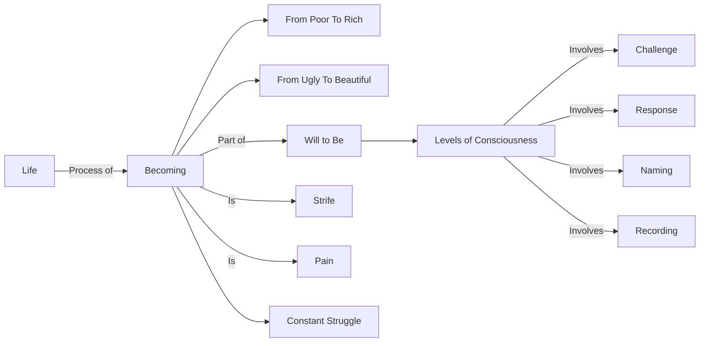

February 1
Becoming is strife

Life as we know it, our daily life, is a process of becoming. I am poor and I act with an end in view, which is to become rich. I am ugly and I want to become beautiful. Therefore my life is a process of becoming something. The will to be is the will to become, at different levels of consciousness, in different states, in which there is challenge, response, naming and recording. Now, this becoming is strife, this becoming is pain, it is not? It is a constant struggle: I am this, and I want to become that.

